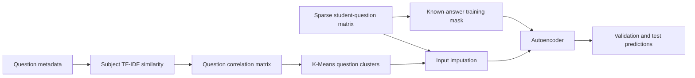
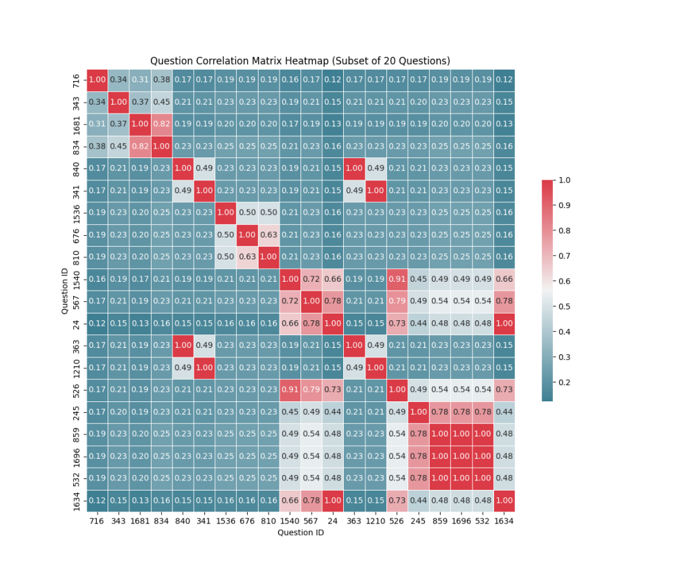

# Extended Neural Network for Sparse Student Response Prediction

This project predicts whether a student will answer a question correctly from a highly sparse student-question interaction matrix. It starts from standard collaborative-filtering and psychometric baselines, then improves a neural autoencoder by using question metadata to make the missing input representation more informative.

The central challenge is sparsity: the training split contains 56,688 observed responses across 542 students and 1,774 questions, leaving roughly 94% of the full response matrix unobserved. Treating every missing value as a real incorrect answer would distort the learning signal. The extended model instead separates missingness from incorrectness, groups related questions through subject metadata, and uses those groups to build better autoencoder inputs.

## Navigation

[Problem](#problem) | [Approach](#approach) | [Model Suite](#model-suite) | [Data](#data) | [Run](#run) | [Results](#results) | [Limitations](#limitations)

## Problem

The dataset contains binary correctness labels for selected `(student, question)` pairs:

- `1`: the student answered correctly.
- `0`: the student answered incorrectly.
- `NaN` in the sparse matrix: the student did not answer the question in the observed data.

The goal is to estimate the probability of correctness for held-out student-question pairs. This is a matrix-completion problem with educational structure: students have latent ability, questions have latent difficulty, and question metadata indicates shared subjects or concepts.

The main modeling issue is that missing entries are not negative examples. They are unobserved interactions. A strong model must train on known answers while still giving the neural network a useful full-length input vector for each student.

## Approach

The repository compares several prediction strategies and focuses on an extended autoencoder pipeline:



### 1. Preserve the Difference Between Wrong and Missing

The base neural network fills missing values with `0`, which is convenient but ambiguous because `0` is also the label for an incorrect answer.

The extended model uses a clearer input encoding:

| Original state | Extended input value | Meaning |
| --- | ---: | --- |
| Correct answer | `1` | Observed positive response |
| Incorrect answer | `-1` | Observed negative response |
| Missing answer with weak cluster evidence | `0` | Unknown or neutral input |
| Missing answer with cluster evidence | `1` or `-1` | Imputed from related questions |

The training target remains the original binary correctness label. Loss is computed only on observed entries by masking out `NaN` targets.

### 2. Build Question Similarity From Metadata

Question metadata maps each question to one or more subject IDs. Subject names are vectorized with TF-IDF, then compared with cosine similarity to create a subject correlation matrix C<sub>S</sub>.

The question-subject assignment matrix `A` links questions to subjects. The question correlation matrix is:

<p align="center"><strong>C<sub>Q</sub> = A C<sub>S</sub> A<sup>T</sup></strong></p>

C<sub>Q</sub> is normalized so each question can be represented by its similarity profile against all other questions.

### 3. Cluster Related Questions

`extended_neural_network.py` applies K-Means to the normalized question correlation matrix. Each question is assigned to a metadata-informed cluster of related questions.

For every missing student-question entry, the model looks at the student's observed answers to other questions in the same cluster:

- If the student has enough local evidence, the missing input is filled with `1` or `-1` using the cluster mean.
- If the student has too little evidence in that cluster, the value remains neutral as `0`.

This gives the autoencoder a denser input vector without pretending that every missing answer is incorrect.

### 4. Train an Autoencoder on Masked Reconstruction

Both `neural_network.py` and `extended_neural_network.py` use the same two-layer autoencoder:

<p align="center">
  <strong>z = sigmoid(W<sub>1</sub>x)</strong><br>
  <strong>x&#770; = sigmoid(W<sub>2</sub>z)</strong>
</p>

For each student, the model reconstructs the full question vector, but the reconstruction loss is evaluated only on observed answers. The implemented objective is squared reconstruction error plus L2 weight decay:

<p align="center">
  <strong>loss = observed reconstruction error + lambda / 2 * (||W<sub>1</sub>||<sup>2</sup> + ||W<sub>2</sub>||<sup>2</sup>)</strong>
</p>

The extended script also computes a decoder-correlation regularization term from C<sub>Q</sub>; however, in the current code it is not added to the final loss. That makes the current implemented improvement primarily the metadata-guided input imputation, plus the same L2 regularization used by the base autoencoder.

## Model Suite

| File | Role |
| --- | --- |
| `majority_vote.py` | Baseline that predicts each question by its historical correctness rate. |
| `knn.py` | User-based and item-based KNN imputation with `sklearn.impute.KNNImputer`. |
| `item_response.py` | One-parameter Item Response Theory model with user ability `theta` and question difficulty `beta`. |
| `matrix_factorization.py` | SVD and ALS matrix factorization scaffold. The SVD helper is implemented; ALS and the main tuning loop are incomplete. |
| `neural_network.py` | Base autoencoder using zero-filled missing inputs and masked reconstruction loss. |
| `extended_neural_network.py` | Metadata-aware autoencoder with question correlation, K-Means clustering, cluster-based imputation, and training curves. |
| `ensemble.py` | Bootstrap ensemble of base autoencoders with averaged predictions. |
| `utils.py` | Shared data loading, evaluation, sparse-matrix prediction, and private-test submission helpers. |
| `data.ipynb` | Exploratory notebook for data inspection and visualization. |

## Data

Expected files live under `data/`:

| File | Description |
| --- | --- |
| `train_sparse.npz` | Sparse student-question matrix used by the model scripts. |
| `train_data.csv` | Observed training triples: `question_id`, `user_id`, `is_correct`. |
| `valid_data.csv` | Validation triples with correctness labels. |
| `test_data.csv` | Public test triples with correctness labels. |
| `private_test_data.csv` | Private test triples for submission generation. |
| `question_meta.csv` | Question-to-subject mapping. |
| `subject_meta.csv` | Subject IDs and subject names. |
| `student_meta.csv` | Student-level metadata. This is available but not currently used by the main models. |

Current dataset summary:

| Split / asset | Size |
| --- | ---: |
| Students | 542 |
| Questions | 1,774 |
| Subjects | 388 |
| Training observations | 56,688 |
| Validation observations | 7,086 |
| Public test observations | 3,543 |
| Private test rows | 3,544 |
| Approximate missing rate in full train matrix | 94% |

## Run

Install the scientific Python stack used by the scripts:

```bash
python3 -m pip install numpy scipy pandas torch scikit-learn matplotlib seaborn
```

Run individual models from the repository root:

```bash
python3 knn.py
python3 item_response.py
python3 neural_network.py
python3 extended_neural_network.py
python3 ensemble.py
```

The extended model uses these default hyperparameters:

| Parameter | Default |
| --- | ---: |
| Autoencoder latent dimension `k` | 50 |
| K-Means clusters `k_mean` | 14 |
| Learning rate | 0.005 |
| Epochs | 80 |
| L2 regularization `lambda` | 0.001 |

`extended_neural_network.py` prints epoch-level training and validation metrics, visualizes a subset of the question correlation matrix, and reports final public test accuracy.

## Results

The performance chart below summarizes the main model comparison and highlights the gain from metadata-guided imputation in the extended neural network.



The existing project notes report the following public test accuracies:

| Model | Test accuracy |
| --- | ---: |
| User-based KNN | 0.6890 |
| Item-based KNN | 0.6894 |
| IRT | 0.6994 |
| Base NN, no regularization | 0.6808 |
| Base NN, L2 regularization | 0.6861 |
| Extended NN, metadata-guided imputation | 0.6991 |
| Extended NN, metadata-guided imputation + L2 | 0.6997 |

The strongest result is the extended neural network with metadata-guided imputation and L2 weight decay. Its improvement over the base neural network suggests that the autoencoder benefits from a less ambiguous input representation and from question groups that reflect shared subject structure.

The IRT baseline remains highly competitive. This is expected for student-response data because IRT directly models the two most important latent factors: student ability and question difficulty. The extended autoencoder approaches this performance while using a more flexible representation that can absorb richer metadata in future iterations.

## Limitations

The current implementation is a strong prototype, but several limitations are worth noting:

- The cluster imputation rule uses subject similarity but not question difficulty, so easy and hard questions inside the same subject cluster may be treated too similarly.
- Student metadata is loaded in the dataset but not used by the main predictive models.
- The decoder-correlation regularization term is computed in `extended_neural_network.py` but not currently included in the loss.
- K-Means is applied to the full question-correlation profile, which is simple and effective for this scale but may be expensive for larger question banks.
- The autoencoder training loop iterates student by student rather than using mini-batches, so training can be slow.
- `matrix_factorization.py` still contains incomplete ALS and tuning sections.

## Future Work

High-impact next steps:

- Add the computed C<sub>Q</sub> decoder regularization term to the loss and tune its coefficient separately from L2 weight decay.
- Incorporate question difficulty, subject hierarchy, and student metadata into the extended model.
- Replace hard cluster imputation with soft similarity-weighted imputation.
- Batch the autoencoder training loop for faster experiments.
- Add a reproducible experiment runner and a `requirements.txt` file.
- Complete the ALS matrix factorization baseline and compare it under the same validation protocol.

## Acknowledgments

This project uses PyTorch for neural modeling, scikit-learn for KNN, K-Means, TF-IDF, and cosine similarity, SciPy for sparse matrices, and pandas for metadata processing.
